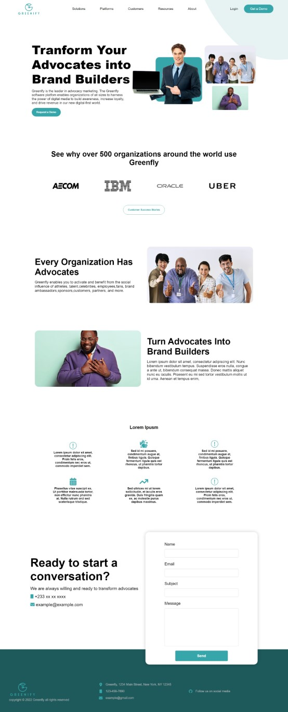

# Greenfly-Vue

Greenfly website rebuilt using Vue.js configured in vite
<br>
This project tries to follow the best practices on vue.js and vite. It is a work in progress and will be updated as I learn more about vue.js and vite.

## Screenshots

### Desktop

<div style="display:flex">


</div>

## Project Setup

```sh
npm install
```

### Compile and Hot-Reload for Development

```sh
npm run dev
```

### Compile and Minify for Production

```sh
npm run build
```
